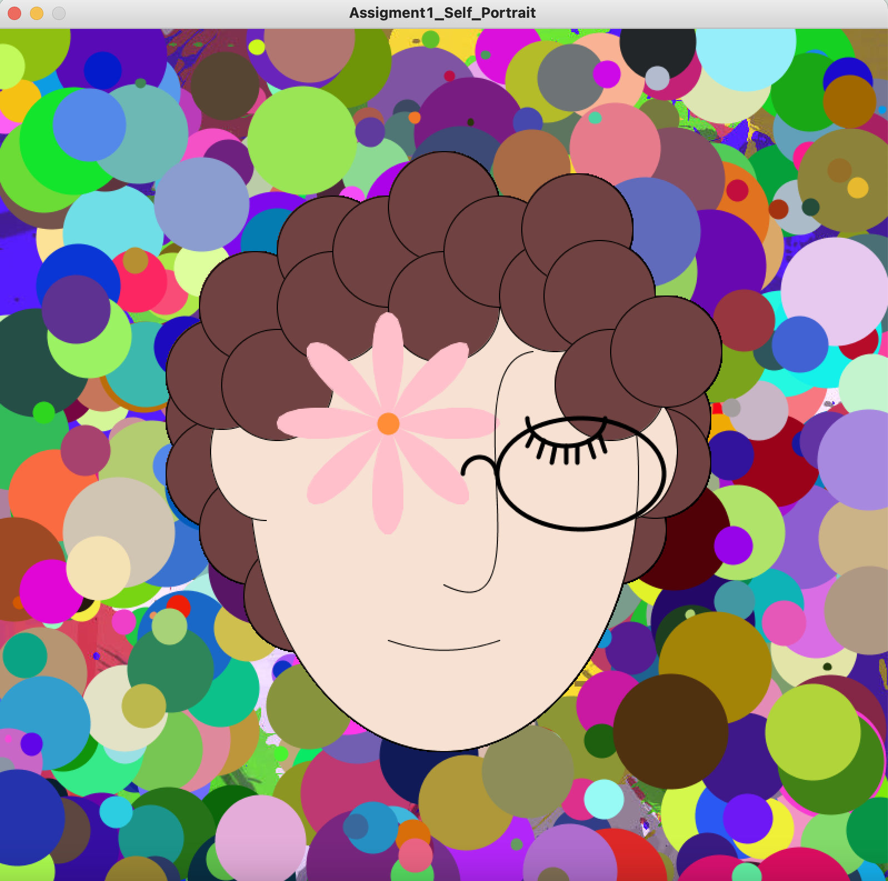

# Assignment 1: Self Portrait 

## Description

This sketch is a self-portrait of Thais. The hair looks nicer in the drawing than in real life, but that is alright, we are not aiming for perfection because as Professor Shiloh wrote, "The portrait does not need to be realistic". There is a changing background in which circles of different sizes and colors are constantly been drawn. The background represents Thais's changing and emerging thoughts, which I think looks cool.

## My experience (mainly problems)
I enjoyed playing around with Processing. The functions work in very interesting ways and having the parameters in mind can be tricky sometimes (specially with arcs and curves). I had major difficulties learning how to use the curve and curveVertex functions. The curves were either too tiny or too prominent, and so, after cracking my head for about two hours, I decided to try the bezier and found it to be better for the nose shape. I hadn't really planned on using a flower as the left eye, but after reading the beginShape and endShape function, I thought it would be interesting to try it out and the first thing that popped in my head was trying to use the formula for a rose in mathematics in order to create a flower shape. I played around with different values of k (the value that controls the size of the angle of the petals) and settled for 4 at the end. I spent so much time trying to get the flower that I thought I might as well use it in the self-portrait assigment, thus I added the 350 and 355 x and y values to the position of the petals. 

On the other hand, I had a really hard time with the hair. Positioning the circles that make the hair was quite a hazzle and a very tideous job. I thought about writing a for loop for it, but it just made matter more complicated because there are two sections of hair (the front which is above the face image and the back that is behind the oval that makes the face)so I settled for hardcoding everything. I also learned about the PImage variable and used it as a way to fill up the blank spaces instead of just setting some monotonous background (I also wanted to practice loading an image because this gave me some trouble at the beginning). I added this image to the file so you can load it too.

Afterwards, I was a tutorial by Daniel Shiffman about the setup and draw functions and decided to make the sketch a little more interesting by using the draw function with random circles. I thought this would be a nice way to represent how my ideas change constantly because I think that the portrait is drawn in a self-reflective manner (at least that's how I tried with the expression on my face). The circles looked really good in my opinion, but after some seconds they started covering the image that I had invested two days in drawing and I didn’t know what to do. So, I texted in the Discord chat and after Professor Shiloh's explanation, I decided to just write the drawing after creating the random circles in order for it to appear above. And it worked! 

Even though it is a very simple drawing, I found it quite challenging to do, but I am very happy with the results. 

## Final Result

